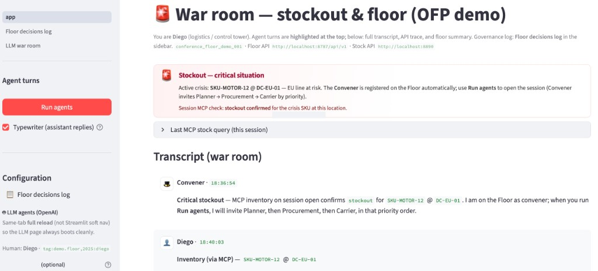

# STOCKOUT — War room (Streamlit)

Standalone UI for the **stockout crisis + OFP floor** demo: transcript, HTTP inventory, convener, agent turns, skill/spec, revoke. The Floor API and stock mock can run **from this repo** via Docker (see below). You can still point `FLOOR_API` / `STOCK_API` at a full **FLOOR** stack if you prefer.

Public repo: [github.com/diegogosmar/stockout](https://github.com/diegogosmar/stockout)

## Screenshot (war room home)



## Prerequisites

1. **Floor + stock (recommended, self-contained)** — from **this** folder:

   ```bash
   cd /path/to/STOCKOUT
   docker compose up -d
   ```

   Check: `curl -s http://localhost:8787/health` and `curl -s http://localhost:8890/health`

   Vendored code lives under `services/` (see `services/README.md` to refresh from the canonical FLOOR repo).

2. **Alternative:** run the full stack from the separate **FLOOR** repository instead:

   ```bash
   cd ../FLOOR
   docker compose up -d
   ```

3. Python 3.11+ and a venv in **STOCKOUT**:

   ```bash
   cd /path/to/STOCKOUT
   python3 -m venv .venv
   source .venv/bin/activate   # Windows: .venv\Scripts\activate
   pip install -r requirements.txt
   ```

   Optional: for **LLM agents** (`pages/3_LLM_war_room.py`), set `OPENAI_API_KEY` in the environment or paste the key in that page’s sidebar (`openai` package is in `requirements.txt`).

   Optional: for **MCP stock demo** on the home page (`Stock via MCP (lite)` in the sidebar), install the MCP SDK on top of the base venv — the default `requirements.txt` stays unchanged so nothing breaks if you skip it:

   ```bash
   pip install -r requirements-mcp-demo.txt
   ```

## Run the UI

From the **STOCKOUT** root:

```bash
streamlit run app.py
```

Open the URL printed in the terminal (usually `http://localhost:8501`).

## Environment variables

| Variable | Default | Description |
|----------|---------|-------------|
| `FLOOR_API` | `http://localhost:8787/api/v1` | Floor API base URL (FLOOR repo). |
| `STOCK_API` | `http://localhost:8890` | Stock mock (`stock-inventory` service in FLOOR compose). |
| `FLOOR_DEMO_CONVERSATION_ID` | `conference_floor_demo_001` | Floor conversation id + SSE. |
| `FLOOR_DEMO_HUMAN_NAME` | `Diego` | Human name in the war room. |
| `FLOOR_DEMO_HUMAN_SPEAKER_URI` | `tag:demo.floor,2025:diego` | Human speaker URI (future extensions). |

Copy `.env.example` to `.env` if your tools load env from a file (Streamlit does not load `.env` by itself: export in the shell or use a wrapper).

## Contents

| Path | Role |
|------|------|
| `LICENSE` | MIT license. |
| `docker-compose.yml` | Local **Floor API** (8787) + **stock mock** (8890); run from STOCKOUT root. |
| `docs/war-room-demo.png` | README screenshot (war room home). |
| `services/` | Vendored FastAPI Floor `src/` + stock `examples/` (see `services/README.md`). |
| `app.py` | Streamlit application. |
| `stockout_mcp/` | Optional MCP stdio server (`get_inventory` → `STOCK_API` HTTP); used by the sidebar when `requirements-mcp-demo.txt` is installed. |
| `pages/2_Floor_decisions_log.py` | Governance decisions log (separate page). |
| `pages/3_LLM_war_room.py` | **OpenAI** Planner → Procurement → Carrier (same Floor API); prompts under `assets/llm_agents/`. |
| `assets/llm_agents/` | Markdown **SKILLS.md** + per-agent prompts; editable in the LLM page and **saved to disk** from there. |
| `floor_helpers.py` | Shared fetch/render for the log page. |
| `verify_streamlit.py` | AppTest smoke check (`python verify_streamlit.py`). |
| `assets/SKILL.md` | Demo checklist. |
| `assets/spec_lookup.py` | OFP 1.1.0 spec title lookup (HTTP + local cache). |
| `assets/DEMO_USER_STORY.md` | Presentation narrative. |

## FLOOR documentation (conference scripts)

In the FLOOR repo: `docs/CONFERENCE_FLOOR_DEMO_SCRIPT.md`, `docs/CONFERENCE_REHEARSAL_CHECKLIST.md`.

## License

This project is licensed under the [MIT License](LICENSE).

## Security

Do not commit `.env`, API keys, or `.streamlit/secrets.toml`. The OpenAI key field in the sidebar is optional and should not appear in recorded screens without consent.
