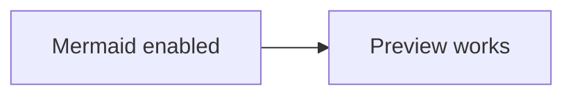
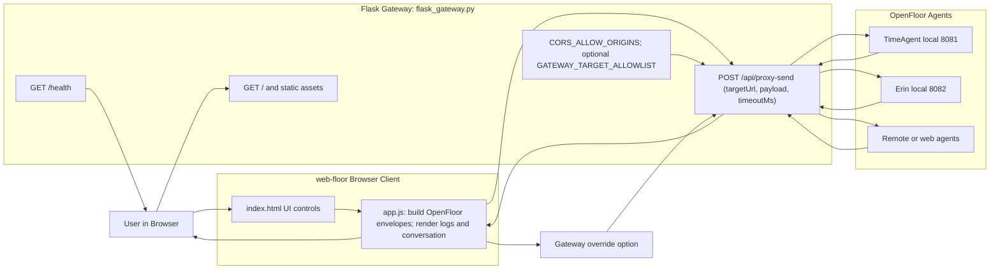

# web-floor Architecture

This document describes the current `web-floor` implementation using a browser UI and a thin Flask gateway.

## Diagram

If Mermaid still does not render in VS Code preview, open `architecture.html` in a browser for a no-extension fallback view.

Sanity check:

## Notes

- Browser code sends all agent calls through `/api/proxy-send`.
- Gateway forwards requests to local or remote OpenFloor agents.
- Gateway returns a normalized response envelope: `ok`, `status`, `statusText`, `text`, `json`.
- Browser can point at an external gateway with either:
  - query parameter: `?gateway=http://localhost:8090`
  - global variable: `window.WEB_FLOOR_GATEWAY_BASE_URL`
