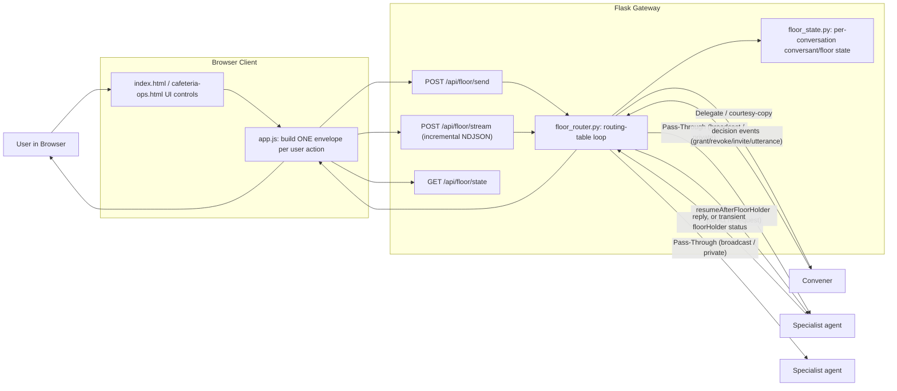
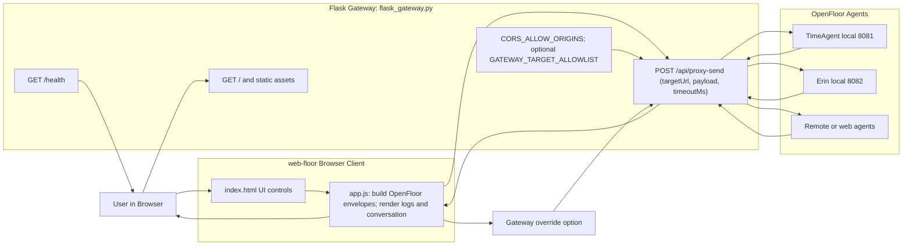

# web-floor Architecture

`web-floor` is a browser UI backed by a Flask gateway. The gateway supports two
distinct paths: a spec-literal **floor manager** (the default, spec-compliant
path for multi-agent conversations) and a **raw relay** for manual single-agent
pokes. Both are described below.

## Floor Manager Path (default)

The gateway implements the Open Floor Protocol's Pass-Through /
Delegate-to-Convener routing table (Interoperable Conversation Envelope Spec
v1.1.1, section 2.2). Instead of the browser fanning an event out to every
target itself, it posts one envelope to the gateway, which owns all
conversant/floor state for the conversation and decides where each event
actually goes.

### Routing table

| Event | If convener present | If no convener |
|---|---|---|
| `utterance` (sender holds floor) | **Pass-Through** | — |
| `utterance` (sender doesn't hold floor) | Delegate | Ignore |
| `invite`, `uninvite` | Delegate to Convener | Pass-Through |
| `declineInvite`, `acceptInvite`, `bye`, `getManifests`, `publishManifests`, `yieldFloor` | Pass-Through | — |
| `requestFloor` | Delegate to Convener | Send `grantFloor` |
| `grantFloor`, `revokeFloor` | Delegate to Convener | Pass-Through |

- **Pass-Through** delivers to every conversant (or the single recipient named
  by a private utterance's `to` field).
- **Delegate to Convener** forwards the event to whichever conversant declared
  `openFloorRoles.convener` in its manifest (auto-detected on `acceptInvite`);
  convener's returned events are trusted and executed directly, never
  re-delegated.
- The convener also receives a **courtesy copy** of every Pass-Through
  utterance, exactly like any other conversant would, which is what gives it
  its chance to act without any special-casing in the table above.
- Every agent-facing envelope carries `conversation.conversants` — the
  identification block of everyone currently on the floor (built by
  `_build_outbound_envelope` via `_conversants_payload`, not just for the
  convener call). A recipient can use it to tell "I'm the only agent here"
  from "someone else can presumably handle this."

### Incremental streaming

`/api/floor/stream` returns NDJSON and is genuinely incremental: the router
takes an `on_event` callback and emits each executed event (and each
per-conversant `working`/`idle` progress line) as it happens, rather than
buffering the whole round and flushing at the end. `/api/floor/send` runs
the same routing loop with no callback and returns the aggregated envelope.

### Floor-holder status and resume

An agent whose real work will outlast the request timeout can first return a
transient **floor-holder** reply — an `utterance` flagged with the
`floorHolder` feature ("checking the nutrition levels…") — instead of its
answer. When `deliver_and_collect` sees one it:

1. streams that status straight to the client via `on_event` (so the UI can
   show "what this agent is working on"), but does **not** finalize it — the
   floor-holder utterance never re-enters the routing table;
2. sends a `resumeAfterFloorHolder` `utterance` directly back to that same
   conversant (carrying the conversation id and the original text), and
   returns whatever that second call replies with as the agent's answer.

The resume request is point-to-point and never enters the routing table.
Agents that don't use the protocol just answer normally and this path is a
no-op.

### Concurrency model

The spec's normative sequential-processing rule governs the *event queue*
(events are processed one at a time, in order) — it does not forbid
delivering a single Pass-Through event to multiple recipients concurrently.
`floor_router.py` delivers to multiple targets over a small thread pool, then
enqueues the collected replies in stable order; the queue itself is still
drained strictly one event at a time. This recovers full concurrency for
"ask everyone" broadcasts without violating the sequential-processing rule.

### Known deviation: floorGranted default on invite

The spec's curation rule defaults a newly-invited conversant to
`floorGranted: true`. This project immediately reconciles that down to
`false` via an explicit `revokeFloor` right after each invite (see
`floor_router.py`'s `apply_local_state`). Each specialist agent's own local
floor gate independently defaults the same way (see
`agents/base_strategy_agent.py`'s `_handle_invite` in the startup-strategy
project). This is deliberate defense-in-depth: even if the floor manager had
a bug and a conversant were delivered an utterance it shouldn't answer, the
agent's own local gate is a second, independent line of defense against
double-answering.

## Raw Relay Path (manual pokes)

`/api/proxy-send` and `/api/proxy-stream` are unchanged from the original
implementation: a stateless single-target relay with no floor/conversant
tracking, for manually poking one agent directly from the UI.

## Notes

- Browser code sends floor-managed conversation traffic through
  `/api/floor/send`/`/api/floor/stream`, and manual single-agent pokes
  through `/api/proxy-send`/`/api/proxy-stream`. Both paths coexist.
- Two static UIs ship in `public/` and both drive the floor path: the
  general-purpose `index.html`, and `cafeteria-ops.html`, a task-styled
  "Cafeteria Ops Planner" board over the cafeteria-ops convener plus
  specialists (it also renders floor-holder working notes and pulls recipe
  images from themealdb.com).
- Gateway forwards requests to local or remote OpenFloor agents.
- `/api/proxy-send` returns a normalized response envelope: `ok`, `status`,
  `statusText`, `text`, `json`. `/api/floor/send` and `/api/floor/stream`
  return an aggregated OpenFloor envelope whose `events` are the ordered
  list of everything the floor manager executed.
- Browser can point at an external gateway with either:
  - query parameter: `?gateway=http://localhost:8090`
  - global variable: `window.WEB_FLOOR_GATEWAY_BASE_URL`
