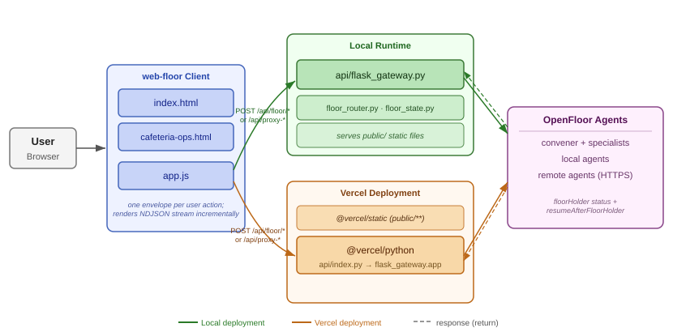

# web-floor

JavaScript web version of the Python `assistantClient`.

## Features
- Invite/uninvite agents
- Send utterances (broadcast or selected agents)
- Directed utterance routing by leading conversational name (`to.speakerUri`)
- Grant/revoke floor events per agent
- Conversation history with conversational-name preference
- Agent status indicators (idle/error/working pulse)
- Incoming/outgoing envelope logging

## Architecture



## Run locally (Flask gateway + JS client)
```bash
cd implementations/web-floor
python -m pip install -r requirements.txt
python api/flask_gateway.py
```

Open: `http://localhost:8090`

Optional environment variables:
- `PORT` (default `8090`)
- `HOST` (default `0.0.0.0`)
- `DEBUG` (default `false`)
- `CORS_ALLOW_ORIGINS` (default `*`, comma-separated list supported)
- `GATEWAY_TARGET_ALLOWLIST` (optional comma-separated URL prefixes)

## Deploy on Vercel
Deploy this folder as its own Vercel project with Root Directory set to `implementations/web-floor`.

Included deployment files:
- `api/index.py` for the Vercel Python entrypoint
- `requirements.txt` for Flask
- `vercel.json` to serve static UI from `public/` and route gateway APIs to Python

Current Vercel routing behavior:
- `public/**` served by `@vercel/static`
- `/api/*` and `/health` routed to `api/index.py` (`@vercel/python`)
- `/` served as `public/index.html`

Recommended environment variables:
- `CORS_ALLOW_ORIGINS` set to your deployed web-floor origin, or `*` for broad access
- `GATEWAY_TARGET_ALLOWLIST` set to the public agent URL prefixes you want this proxy to reach

Important notes for Vercel:
- `localhost` agents in `public/app.js` will not work from a deployed Vercel project
- The known-agent dropdown hides `localhost` endpoints when the client is served from a non-local web host, and shows them when running locally
- Use public HTTPS agent endpoints for Stella, TimeAgent, and any other invited agents
- Redeploy without cache after changing gateway configuration

If the UI is hosted elsewhere, set a gateway URL via either:
- query param: `?gateway=http://localhost:8090`
- global before `app.js`: `window.WEB_FLOOR_GATEWAY_BASE_URL = "http://localhost:8090"`

## Notes
- The web app uses a Flask proxy (`/api/proxy-send`) in `api/flask_gateway.py` to send OpenFloor payloads to agents.
- Node runtime is not required for this implementation.
- Known agents are configured in `public/app.js` (`KNOWN_AGENTS`).
- Localhost entries in the known-agent UI are only shown in local client contexts.
- Additional architecture detail is available in `ARCHITECTURE.md` and `architecture.mmd`.
